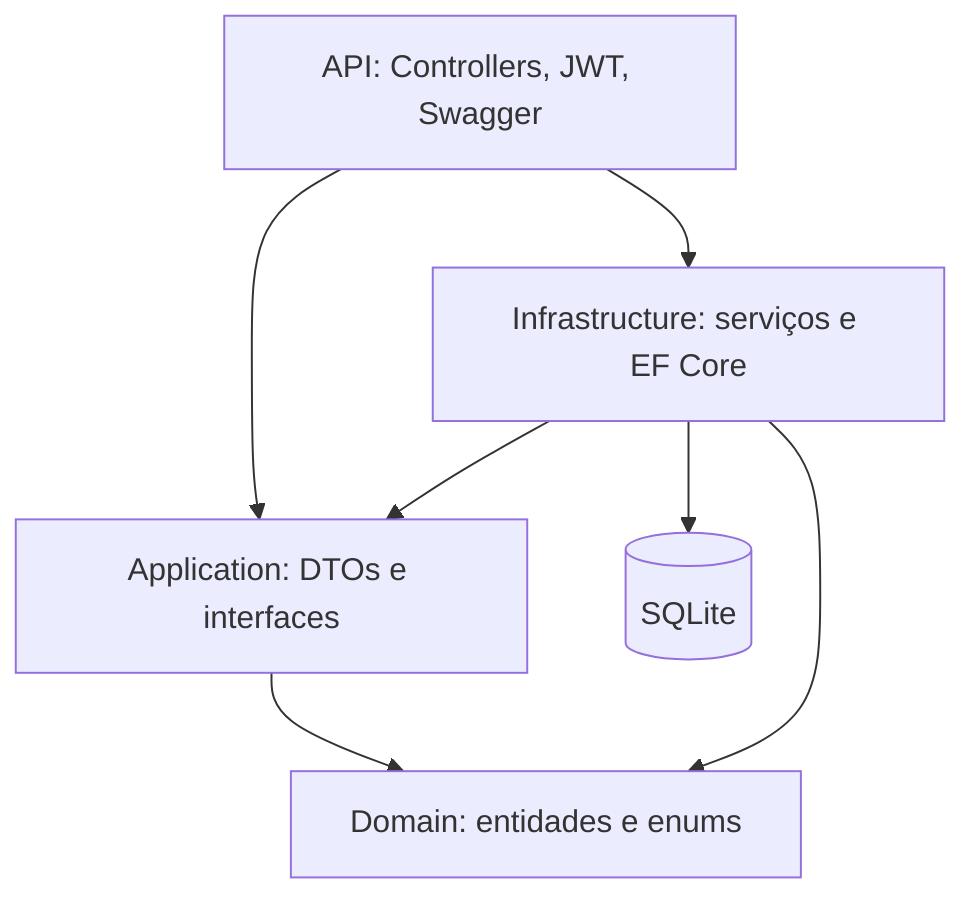
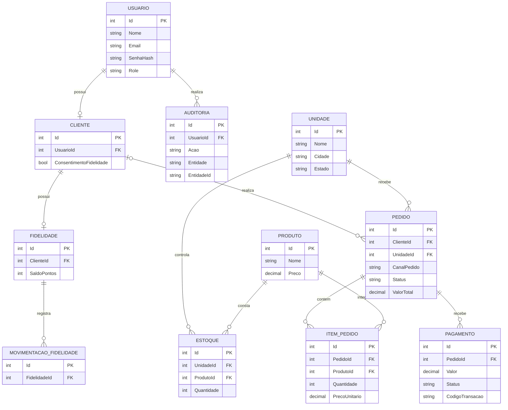
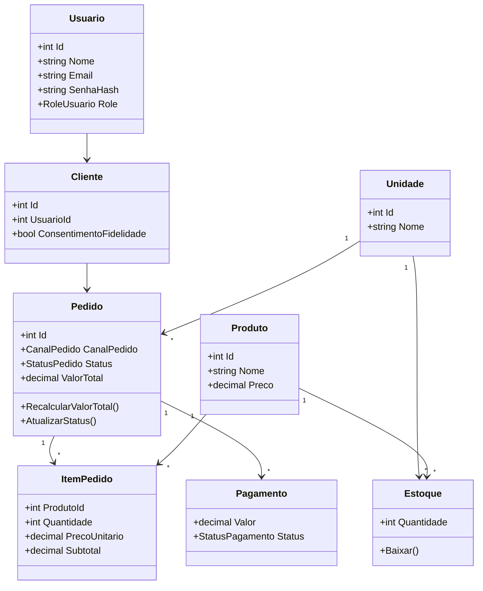
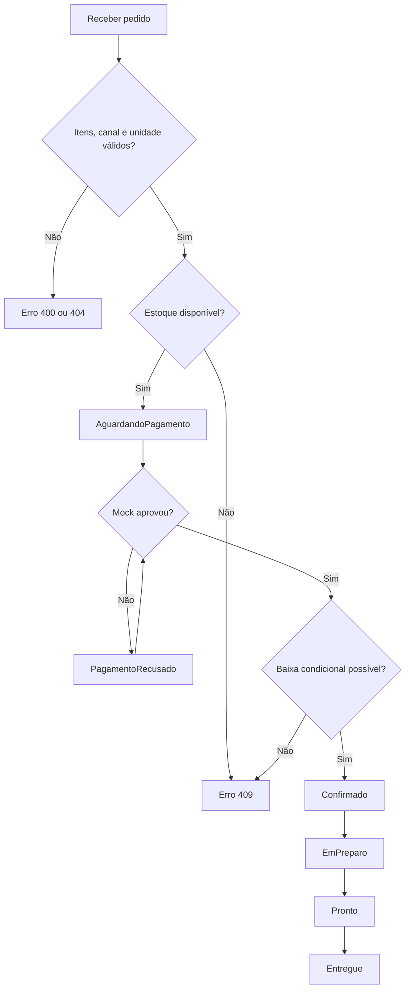

# Diagramas técnicos da Raízes do Nordeste

Estes diagramas documentam o **modelo conceitual e o fluxo funcional** implementado. Para documentação física do banco, conferir `AppDbContext` e as migrations.

## 1. Arquitetura em camadas

## 2. Diagrama conceitual de entidades e relacionamentos

## 3. Diagrama simplificado de classes de domínio

## 4. Fluxo de pedido e pagamento mock

## 5. Atores e casos de uso

O diagrama UML de casos de uso está disponível em `casos-de-uso.puml`. Pode ser renderizado com PlantUML para o relatório acadêmico.
